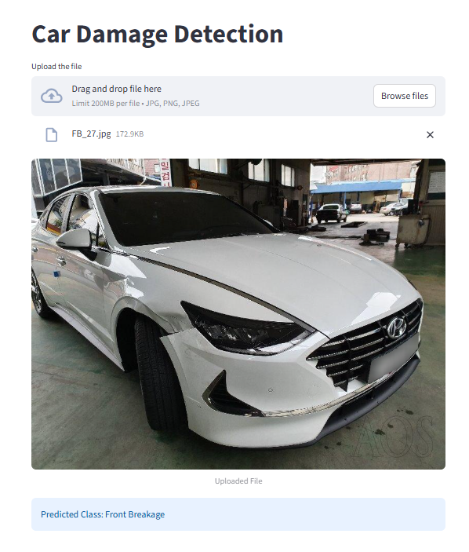

# 🚗 Car Damage Detection App

This is a Streamlit-based web application that allows users to upload an image of a vehicle and automatically detect the type of damage using a deep learning model.


## 📷 Application Preview



---

## 🧠 Model Information

- **Model Architecture:** ResNet50 (Transfer Learning)
- **Training Images:** ~1700
- **Validation Accuracy:** ~80%

### Damage Categories

The model can classify vehicle images into the following six classes:

- Front Normal
- Front Crushed
- Front Breakage
- Rear Normal
- Rear Crushed
- Rear Breakage

---

## 🚀 Installation

### 1. Clone the Repository

```bash
git clone <repository-url>
cd <repository-folder>
```

### 2. Install Dependencies

```bash
pip install -r requirements.txt
```

### 3. Run the Application

```bash
streamlit run app.py
```

---

## 📌 Features

- Upload vehicle images through a simple web interface
- Deep learning-based damage classification
- Supports six different damage categories
- Fast and user-friendly interface powered by Streamlit

---


## 🛠️ Technologies Used

- Python
- Streamlit
- ResNet50 (Transfer Learning)
